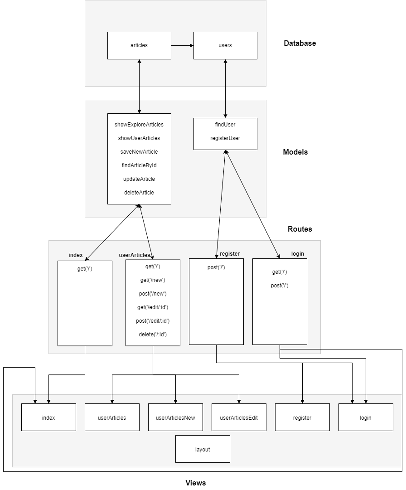

# Platforma blogowa

W dzisiejszych czasach idea platformy blogowej jest znana większości użytkowników internetu. Jest to elastyczne rozwiązanie, które potrafi przekazywać informacje na temat wielu tematów takich jak marketing, sprzedaż czy oferowane usługi danego biznesu.   

---

Aplikacja jest wprowadzeniem do tematu bloga. Obecnie umożliwia przeglądanie opublikowanych blogów przez wszystkich użytkowników platformy (sekcja explore) jak i zarządzanie blogami użytkownika (dodawanie, edycja, usuwanie, oglądanie). W przyszłości warto byłoby dodać takie elementy jak tworzenie/edycja postów w markdownie, system komentarzy, polubień i udostępnień.  

---

Aplikacja została stworzona wedle modelu MVC. Backend aplikacji zgodnie z wymaganiami wykorzystuje technologie NodeJS i ExpressJS, i istnieje jako API z endpointami. Jako technologię frontendową wykorzystano silnik szablonów Pug. Baza danych zoztała stworzona przy pomocy SQLite. W bazie znajdują się następujące tabele z ich kolumnami: 

- articles: 

	- ArticleID 

	- Header 

	- Content 

	- UserID 

- users: 

	- UserID 

	- Email 

	- Password 

- sessions: 

	- sid 

	- expired 

	- sess 

---
Aby uruchomić aplikację należy: 
1. zainstalować zależności: `npm install`

2. uruchomić aplikację z poziomu konsoli: `npm start` lub `npm run watch`

3. otworzyć aplikację w przeglądarce, wpisując następujący adres: `localhost:3000` dla HTTP lub `localhost:3443` dla HTTPS 

---

Do sekcji explore mają dostęp wszyscy, niezalogowani też. Niezalogowany użytkownik zobaczyć może wtedy posty wszystkich użytkowników platformy. Zalogowany użytkownik zobaczy na tej stronie tylko posty nienależące do niego. Po przejściu do sekcji “My articles”, do której dostęp ma tylko zalogowany użytkownik, widnieją wszystkie posty użytkownika. 

Do walidacji wpisów użytkownika wykorzystano express-validator, a do hashowania haseł bcrypt. Uwierzytelnienie zostało oparte o sesje wykorzystując do tego express-session. Stan jest przetrzymywany w pamięci serwera.  

---

Flow uwierzytelnienia: 

- Użytkownik wypełnia formularz logowania i wysyła dane (login i hasło) do serwera 

- Serwer sprawdza dane w bazie danych 

- Jeśli dane się zgadzają, serwer tworzy sesję i przetrzymuje ją w bazie danych 

- Serwer wysyła ciasteczko z ID sesji do użytkownika 

- Użytkownik wysyła ciasteczko przy każdym zapytaniu 

- Serwer waliduje poprawność ID sesji zgodnie z sesją w bazie danych i przydziela dostęp 

- Gdy użytkownik się wyloguje, serwer niszczy sesję

---

